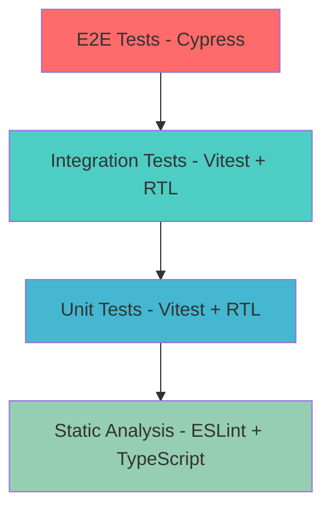

# Testing Strategy Design Document

## Overview

This design document outlines a comprehensive testing strategy for the Lingua language learning application. The strategy focuses on ensuring code quality, reliability, and maintainability through a multi-layered testing approach that includes unit tests, integration tests, and end-to-end testing workflows.

The testing architecture leverages Vitest as the primary testing framework, React Testing Library for component testing, and MSW (Mock Service Worker) for API mocking, providing a robust foundation for test-driven development.

## Architecture

### Testing Pyramid Structure



### Test Categories and Distribution

- **Unit Tests (70%)**: Individual component and function testing
- **Integration Tests (20%)**: Feature workflow and API integration testing
- **End-to-End Tests (10%)**: Critical user journey validation

### Testing Stack

- **Test Runner**: Vitest (fast, ESM-native, TypeScript support)
- **Component Testing**: React Testing Library (user-centric testing)
- **Mocking**: MSW for API mocking, vi.mock for modules
- **E2E Testing**: Cypress (comprehensive browser testing)
- **Coverage**: Built-in Vitest coverage with c8

## Components and Interfaces

### Test File Organization

```
src/
├── __tests__/
│   ├── components/
│   │   ├── shared/
│   │   │   ├── NoteCard.test.tsx
│   │   │   ├── NoteForm.test.tsx
│   │   │   └── NotesList.test.tsx
│   │   └── ui/
│   │       ├── Button.test.tsx
│   │       └── FormError.test.tsx
│   ├── pages/
│   │   ├── Home.test.tsx
│   │   ├── NoteEditor.test.tsx
│   │   └── Auth.test.tsx
│   ├── features/
│   │   └── notes/
│   │       ├── notesSlice.test.ts
│   │       └── useNotes.test.ts
│   ├── utils/
│   │   ├── test-utils.tsx
│   │   ├── mocks/
│   │   │   ├── handlers.ts
│   │   │   ├── server.ts
│   │   │   └── data.ts
│   │   └── factories/
│   │       └── noteFactory.ts
│   └── e2e/
│       ├── auth.cy.ts
│       ├── notes.cy.ts
│       └── review.cy.ts
```

### Test Utilities Interface

```typescript
// src/__tests__/utils/test-utils.tsx
interface RenderOptions {
  initialState?: Partial<RootState>;
  route?: string;
  user?: User | null;
}

interface TestWrapperProps {
  children: React.ReactNode;
  options?: RenderOptions;
}

export const renderWithProviders = (
  ui: React.ReactElement,
  options?: RenderOptions
) => {
  /* implementation */
};

export const createMockUser = (): User => {
  /* implementation */
};
export const createMockNote = (overrides?: Partial<Note>): Note => {
  /* implementation */
};
```

### Mock Service Worker Setup

```typescript
// src/__tests__/utils/mocks/handlers.ts
export const handlers = [
  rest.get("/api/notes", (req, res, ctx) => {
    return res(ctx.json(mockNotes));
  }),
  rest.post("/api/notes", (req, res, ctx) => {
    return res(ctx.json({ success: true }));
  }),
  // Auth handlers
  rest.post("/auth/v1/token", (req, res, ctx) => {
    return res(ctx.json(mockAuthResponse));
  }),
];
```

## Data Models

### Test Data Factories

```typescript
// src/__tests__/utils/factories/noteFactory.ts
interface NoteFactoryOptions {
  id?: string;
  nativeText?: string;
  learningText?: string;
  noteType?: NoteType;
  tags?: string[];
  reviewCount?: number;
  ease?: number | null;
}

export const createNote = (options: NoteFactoryOptions = {}): Note => ({
  id: options.id ?? faker.string.uuid(),
  nativeText: options.nativeText ?? faker.lorem.word(),
  learningText: options.learningText ?? faker.lorem.word(),
  noteType: options.noteType ?? "word",
  tags: options.tags ?? [faker.lorem.word()],
  createdAt: faker.date.past().toISOString(),
  updatedAt: faker.date.recent().toISOString(),
  pronunciation: faker.lorem.word(),
  voiceUrl: faker.internet.url(),
  slug: faker.lorem.slug(),
  user_id: faker.string.uuid(),
  reviewCount: options.reviewCount ?? 0,
  ease: options.ease ?? null,
  lastReviewedAt: null,
  nextReviewAt: null,
  category: "Darija Basics",
  difficulty: "beginner",
  ...options,
});
```

### Test State Management

```typescript
// src/__tests__/utils/test-store.ts
export const createTestStore = (initialState?: Partial<RootState>) => {
  return configureStore({
    reducer: rootReducer,
    preloadedState: {
      note: {
        isModalOpen: false,
        modalContent: "add",
        ...initialState?.note,
      },
      ...initialState,
    },
  });
};
```

## Error Handling

### Test Error Scenarios

```typescript
// Error boundary testing
export const TestErrorBoundary = ({
  children,
}: {
  children: React.ReactNode;
}) => (
  <ErrorBoundary fallback={<div>Something went wrong</div>}>
    {children}
  </ErrorBoundary>
);

// Network error simulation
export const simulateNetworkError = () => {
  server.use(
    rest.get("/api/notes", (req, res, ctx) => {
      return res.networkError("Network error");
    })
  );
};

// Authentication error handling
export const simulateAuthError = () => {
  server.use(
    rest.post("/auth/v1/token", (req, res, ctx) => {
      return res(ctx.status(401), ctx.json({ error: "Invalid credentials" }));
    })
  );
};
```

### Async Error Testing Patterns

```typescript
// Testing async operations with error handling
describe("Note operations error handling", () => {
  it("should handle API errors gracefully", async () => {
    simulateNetworkError();

    render(<HomePage />);

    await waitFor(() => {
      expect(screen.getByText(/failed to load notes/i)).toBeInTheDocument();
    });
  });
});
```

## Testing Strategy

### Component Testing Approach

1. **Render Testing**: Verify components render without crashing
2. **Props Testing**: Test component behavior with different prop combinations
3. **User Interaction Testing**: Simulate user events and verify responses
4. **State Testing**: Verify component state changes correctly
5. **Integration Testing**: Test component integration with hooks and context

### Form Testing Strategy

```typescript
// NoteForm testing pattern
describe("NoteForm", () => {
  const mockOnSubmit = vi.fn();

  beforeEach(() => {
    mockOnSubmit.mockClear();
  });

  it("should validate required fields", async () => {
    render(<NoteForm onSubmit={mockOnSubmit} />);

    const submitButton = screen.getByRole("button", { name: /save note/i });
    await user.click(submitButton);

    expect(screen.getByText(/native text is required/i)).toBeInTheDocument();
    expect(mockOnSubmit).not.toHaveBeenCalled();
  });

  it("should submit valid form data", async () => {
    render(<NoteForm onSubmit={mockOnSubmit} />);

    await user.type(screen.getByLabelText(/native text/i), "Hello");
    await user.type(screen.getByLabelText(/learning text/i), "مرحبا");
    await user.click(screen.getByRole("button", { name: /save note/i }));

    expect(mockOnSubmit).toHaveBeenCalledWith(
      expect.objectContaining({
        nativeText: "Hello",
        learningText: "مرحبا",
      })
    );
  });
});
```

### Hook Testing Strategy

```typescript
// Custom hook testing with renderHook
describe("useNotes", () => {
  it("should fetch notes successfully", async () => {
    const { result } = renderHook(() => useNotes(), {
      wrapper: QueryClientWrapper,
    });

    await waitFor(() => {
      expect(result.current.isSuccess).toBe(true);
    });

    expect(result.current.data).toHaveLength(2);
  });

  it("should handle fetch errors", async () => {
    simulateNetworkError();

    const { result } = renderHook(() => useNotes(), {
      wrapper: QueryClientWrapper,
    });

    await waitFor(() => {
      expect(result.current.isError).toBe(true);
    });
  });
});
```

### Integration Testing Workflows

```typescript
// End-to-end workflow testing
describe("Note Management Workflow", () => {
  it("should complete full CRUD workflow", async () => {
    render(<App />);

    // Navigate to add note
    await user.click(screen.getByRole("button", { name: /add note/i }));

    // Fill and submit form
    await user.type(screen.getByLabelText(/native text/i), "Test Note");
    await user.type(screen.getByLabelText(/learning text/i), "اختبار");
    await user.click(screen.getByRole("button", { name: /save note/i }));

    // Verify note appears in list
    await waitFor(() => {
      expect(screen.getByText("Test Note")).toBeInTheDocument();
    });

    // Edit note
    await user.click(screen.getByRole("button", { name: /edit/i }));
    await user.clear(screen.getByLabelText(/native text/i));
    await user.type(screen.getByLabelText(/native text/i), "Updated Note");
    await user.click(screen.getByRole("button", { name: /save note/i }));

    // Verify update
    await waitFor(() => {
      expect(screen.getByText("Updated Note")).toBeInTheDocument();
    });
  });
});
```

## Performance Testing

### Component Performance Testing

```typescript
// Performance testing with React Testing Library
describe("NotesList Performance", () => {
  it("should render large lists efficiently", () => {
    const manyNotes = Array.from({ length: 1000 }, (_, i) =>
      createNote({ id: `note-${i}`, nativeText: `Note ${i}` })
    );

    const startTime = performance.now();
    render(<NotesList notes={manyNotes} />);
    const endTime = performance.now();

    expect(endTime - startTime).toBeLessThan(100); // Should render in under 100ms
  });
});
```

### Memory Leak Testing

```typescript
// Testing for memory leaks in components
describe("Memory Management", () => {
  it("should cleanup event listeners on unmount", () => {
    const { unmount } = render(<NoteForm onSubmit={vi.fn()} />);

    // Verify cleanup
    unmount();

    // Check that no event listeners remain
    expect(document.addEventListener).toHaveBeenCalledTimes(0);
  });
});
```

## Accessibility Testing

### A11y Testing Integration

```typescript
// Accessibility testing with jest-axe
import { axe, toHaveNoViolations } from "jest-axe";

expect.extend(toHaveNoViolations);

describe("Accessibility", () => {
  it("should have no accessibility violations", async () => {
    const { container } = render(<NoteForm onSubmit={vi.fn()} />);
    const results = await axe(container);
    expect(results).toHaveNoViolations();
  });

  it("should support keyboard navigation", async () => {
    render(<NoteForm onSubmit={vi.fn()} />);

    const nativeTextInput = screen.getByLabelText(/native text/i);
    const learningTextInput = screen.getByLabelText(/learning text/i);

    nativeTextInput.focus();
    await user.keyboard("{Tab}");

    expect(learningTextInput).toHaveFocus();
  });
});
```

## Coverage and Quality Metrics

### Coverage Configuration

```typescript
// vitest.config.ts coverage setup
export default defineConfig({
  test: {
    coverage: {
      provider: "c8",
      reporter: ["text", "html", "lcov"],
      exclude: [
        "node_modules/",
        "src/__tests__/",
        "**/*.d.ts",
        "**/*.config.*",
      ],
      thresholds: {
        lines: 80,
        branches: 70,
        functions: 80,
        statements: 80,
      },
    },
  },
});
```

### Quality Gates

```typescript
// Quality metrics validation
const qualityGates = {
  coverage: {
    lines: 80,
    branches: 70,
    functions: 80,
    statements: 80,
  },
  performance: {
    maxRenderTime: 100, // ms
    maxBundleSize: 500, // KB
  },
  accessibility: {
    violations: 0,
    wcagLevel: "AA",
  },
};
```
